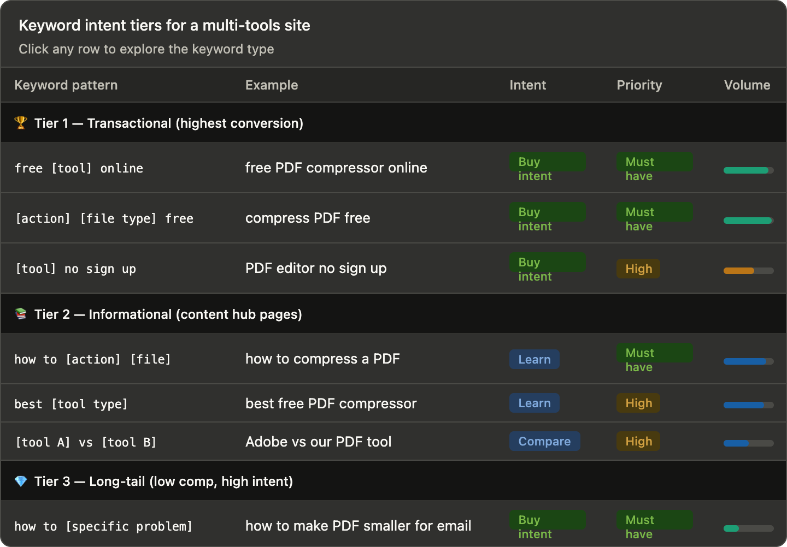
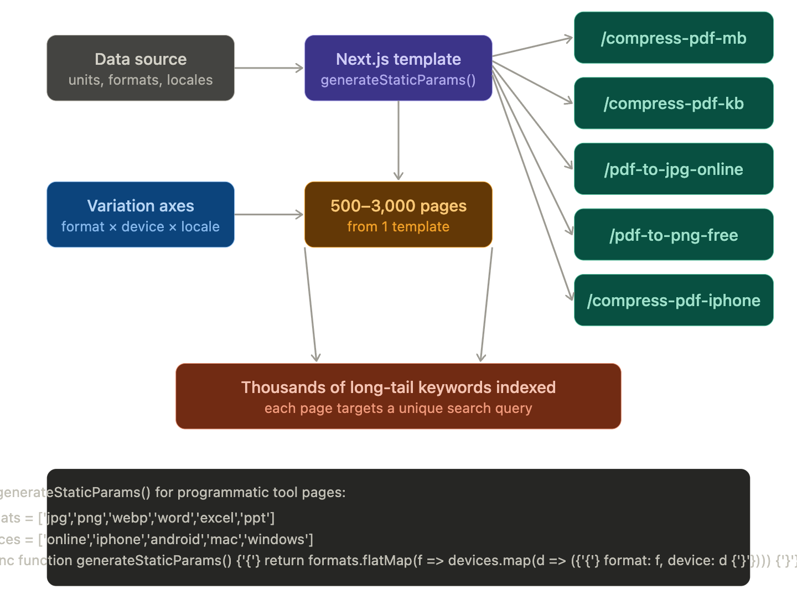

use this link: https://claude.ai/share/8bc9d746-61d7-4f69-b1bf-56b378b36bb8

for better seo guide we discused in this chat session.


Q: what is the best seo hacks of the next.js build tools website, also tell what is the best seo hacks for the bing and google search engine. also the current ai search result tricks to get impression both in the chatbot and the search engine ai overview. as we are building a multi tools website like omnicalculator.com, with other different tools like pdf and image manipulation. I hope you understand. helps me to set best seo trics and content structure for better result.


# Complete SEO & AI Search Strategy for Your Next.js Multi-Tools Website

Here's a full breakdown across four dimensions — Next.js technical SEO, Google/Bing optimization, AI search visibility, and content architecture for a tools site.

---

## ⚙️ 1. Next.js Technical SEO Hacks

### Metadata & Rendering
- **Use `generateMetadata()` per page** — Next.js App Router lets you export dynamic metadata per tool page. Never use a single static `<head>` for all tools.
```js
// app/tools/pdf-compressor/page.tsx
export async function generateMetadata() {
  return {
    title: "Free PDF Compressor – Reduce PDF Size Online",
    description: "Compress PDF files instantly...",
    alternates: { canonical: "https://yoursite.com/tools/pdf-compressor" },
    openGraph: { ... },
    twitter: { ... }
  }
}
```
- **SSG over SSR for tool pages** — Static pages rank faster. Use `generateStaticParams()` for all tool routes. Reserve SSR only for user-generated or dynamic content.
- **ISR (Incremental Static Regeneration)** — Use `revalidate: 86400` for blog/content pages so Google sees fresh content without rebuild cost.

### Performance (Core Web Vitals = Ranking Signal)
- **`next/image`** with correct `width`, `height`, and `priority` on above-the-fold images.
- **`next/font`** to eliminate render-blocking font requests (major LCP killer).
- **Route segment `loading.tsx`** — prevents layout shift, improves CLS score.
- **Bundle analysis** — Run `ANALYZE=true next build` with `@next/bundle-analyzer`. Kill heavy unused packages.
- **Lazy load tool logic** — Don't load PDF.js or image manipulation libs until user interacts:
```js
const PDFWorker = dynamic(() => import('../components/PDFWorker'), { ssr: false })
```

### Crawlability
- **`sitemap.ts` (dynamic)** — Auto-generate sitemap including every tool page:
```js
// app/sitemap.ts
export default function sitemap(): MetadataRoute.Sitemap {
  return tools.map(tool => ({
    url: `https://yoursite.com/tools/${tool.slug}`,
    lastModified: new Date(),
    changeFrequency: 'monthly',
    priority: 0.8,
  }))
}
```
- **`robots.ts`** — Explicitly allow `/tools/`, block `/api/`, `/dashboard/`, `/user/`.
- **Canonical tags on every page** — Especially for tools with query params (e.g., `?unit=kg`). Set canonical to the clean URL.

### Structured Data (JSON-LD)
This is your biggest Next.js SEO advantage. Add schema to every tool:
```js
// Embed in layout or page component
<script type="application/ld+json">
{
  "@context": "https://schema.org",
  "@type": "SoftwareApplication",
  "name": "PDF Compressor",
  "applicationCategory": "UtilityApplication",
  "operatingSystem": "Web",
  "offers": { "@type": "Offer", "price": "0" },
  "featureList": ["Compress PDF", "Reduce file size", "No upload limit"]
}
</script>
```
Also add **`FAQPage`**, **`HowTo`**, and **`BreadcrumbList`** schema on every tool page.

---

## 🔍 2. Google & Bing SEO Hacks

### Google-Specific
- **Target "free online [tool]" keywords** — These have massive transactional intent. Your title tag formula: `Free [Tool Name] Online – No Sign-up Required | YourSite`
- **Page Experience signals** — INP (Interaction to Next Paint) replaced FID in 2024. Your interactive tools MUST respond in <200ms.
- **Internal linking hub** — Create a `/tools` index page that links to every tool with descriptive anchor text. Google uses this to understand site architecture.
- **Topical authority clusters** — For each tool, create: Tool page → How-to guide → FAQ page → Comparison page (e.g., "vs. Adobe Acrobat"). This tells Google you OWN the topic.
- **Win featured snippets** — Structure your tool descriptions with an H2 "What is [Tool]?" followed by a 40-60 word direct answer. Google pulls this for Position Zero.

### Bing-Specific (Often Ignored = Less Competition)
- **Bing Webmaster Tools** — Submit your sitemap directly. Bing indexes slower, so this matters more than on Google.
- **Bing favors older, trusted domains** — Build links from .edu and established sites early.
- **Bing rewards exact-match anchor text** more than Google does currently.
- **Social signals matter more on Bing** — Share every tool page on LinkedIn and Twitter/X. Bing's algorithm explicitly factors social engagement.
- **Bing Chat / Copilot integration** — Bing powers Microsoft Copilot. Being indexed well on Bing = appearing in Copilot answers (covered more below).
- **IndexNow protocol** — Next.js can ping Bing instantly on new page publish:
```js
// Submit to IndexNow on deploy
fetch(`https://api.indexnow.org/indexnow?url=https://yoursite.com/tools/new-tool&key=YOUR_KEY`)
```

---

## 🤖 3. AI Search & Chatbot Visibility (The New Frontier)

This is where most sites are behind. Google AI Overviews, ChatGPT Search, Perplexity, and Bing Copilot all use different signals.

### Google AI Overviews (SGE)
- **Be the definitive answer** — AI Overview pulls from pages that directly answer the full query in one place. Create "Ultimate Guide to [Tool]" pages that answer every sub-question.
- **Use clear H2/H3 question headings** — AI parsers love `<h2>How does a PDF compressor work?</h2>` followed by a clean 2-3 sentence answer.
- **Structured data is critical** — FAQPage schema is directly parsed by Google's AI layer.
- **Avoid thin content on tool pages** — Tool page + 800+ words of contextual content performs far better than tool + 100 words.
- **E-E-A-T signals** — Add author bios, cite data sources, add a clear "About" and "How it works" section. AI Overviews favor authoritative pages.

### ChatGPT / Perplexity / Claude Search
- **Get cited by quality publications** — When TechRadar, G2, or ProductHunt mention your tool, AI models that scraped those sources will surface you in answers.
- **Be on curated lists** — "10 Best Free PDF Tools" articles that mention you become training/retrieval data. Pitch these actively.
- **Your content must be LLM-friendly** — Write in clear, factual, structured prose. Avoid marketing fluff. AI models prefer encyclopedic language.
- **Add a clear "What is [YourSite]?" section** on your About page — AI models look for entity definition content.
- **Structured `About` page with your full entity info:**
```
YourSite is a free online toolset offering PDF compression, image conversion, 
calculators, and 50+ utilities. Founded in [year], it serves [X] users monthly 
with no sign-up required.
```
This paragraph format is directly pulled by LLMs as entity context.

### Perplexity-Specific
- Perplexity heavily cites **Reddit, Quora, and G2**. Create presence there: answer questions mentioning your tool, get reviews on G2.
- Perplexity favors **recently updated content** — add `dateModified` to your JSON-LD and actually update pages quarterly.

### Bing Copilot / Microsoft AI
- Covered by Bing SEO above — same index.
- Add **Bing's VeriSign trust signals** via Bing Webmaster Tools for faster AI citation.

---

## 🏗️ 4. Content Architecture for a Multi-Tools Site

This is the OmniCalculator model — here's how to replicate and beat it:

### URL Structure
```
yoursite.com/                          ← Homepage (authority hub)
yoursite.com/tools/                    ← All tools index (internal link hub)
yoursite.com/tools/pdf/                ← Category page
yoursite.com/tools/pdf/compress/       ← Individual tool
yoursite.com/tools/image/              ← Category page
yoursite.com/tools/image/resize/       ← Individual tool
yoursite.com/guides/                   ← Blog/content hub
yoursite.com/guides/how-to-compress-pdf/
yoursite.com/compare/                  ← Comparison pages
```

### Every Tool Page Must Have
| Section | Purpose |
|---|---|
| **Tool UI** (above fold) | Instant value, low bounce rate |
| **What is [Tool]?** (60 words) | Featured snippet bait |
| **How to use** (numbered steps) | HowTo schema + AI Overview |
| **Why use our tool?** (bullets) | Conversion + crawlability |
| **FAQ** (5-8 Q&As) | FAQPage schema + long-tail keywords |
| **Related tools** (internal links) | PageRank flow + reduced bounce |
| **User reviews/ratings** | E-E-A-T + Rich snippet eligibility |

### Category Pages Strategy
Each category (`/tools/pdf/`, `/tools/image/`) should:
- List all tools with descriptions (not just links)
- Include 300+ words of category-level content
- Target head keywords like "free PDF tools online"
- Have breadcrumb navigation (BreadcrumbList schema)

### Content Velocity Plan
| Month | Action |
|---|---|
| 1-3 | Launch 10-15 core tools, full content on each |
| 3-6 | Publish "How to" guides for each tool |
| 6-9 | Build comparison pages ("Tool A vs Tool B") |
| 9-12 | Target seasonal/trending queries, expand tool set |

---

## ✅ Quick Win Checklist

- [ ] `generateMetadata()` on every tool page with unique title/description
- [ ] Dynamic `sitemap.ts` covering all tools
- [ ] JSON-LD: `SoftwareApplication` + `FAQPage` + `HowTo` + `BreadcrumbList`
- [ ] Core Web Vitals: LCP <2.5s, CLS <0.1, INP <200ms
- [ ] `next/image` + `next/font` everywhere
- [ ] `dynamic()` import for heavy tool libraries
- [ ] IndexNow for Bing on every new tool deploy
- [ ] 800+ words of content per tool page
- [ ] Internal linking: every tool → related tools + category page
- [ ] Submit to G2, ProductHunt, AlternativeTo for AI citation coverage
- [ ] `dateModified` in JSON-LD, update pages quarterly
- [ ] Bing Webmaster Tools + Google Search Console both active

---

The biggest edge you have over OmniCalculator right now is **AI search** — they're an older site optimized for traditional SEO. If you build your content to be LLM-friendly from day one (clear entity definitions, structured prose, rich schema), you'll capture the ChatGPT/Perplexity/AI Overview traffic that they're missing. That's your moat.


Q: any other seo guides or tricks you need to give me for guidance and rank on the top of the search engine?


ans: Here's a deep, advanced SEO guide that goes beyond the basics — covering areas most sites completely ignore.

---

## 🗂️ 1. Site Architecture & Crawl Budget Optimization

For a multi-tools site, your **crawl budget is everything**. Google only crawls a limited number of pages per day — waste it and new tools won't get indexed.**Crawl budget rules for your tools site:**
- Block all `/api/`, `/user/`, `/dashboard/` routes in `robots.txt`
- Use `rel="nofollow"` on pagination and filter links (e.g., `?page=2&sort=asc`)
- Avoid duplicate tool URLs — use canonical tags if a tool is accessible via multiple paths
- Fix all 404s immediately — crawl budget wasted on dead links is lost indexing time
- Set `Cache-Control` headers on static tool pages so Googlebot caches aggressively

---

## 🔗 2. Link Building Strategy (The Real Moat)

Backlinks are still the #1 ranking factor. Here's the playbook for a tools site specifically:

**Free Tool = Link Magnet Strategy**
Build 2-3 "hero tools" that are genuinely the best free version on the internet. These naturally attract links from:
- Bloggers writing "10 free PDF tools" roundups
- Reddit threads asking for tool recommendations
- YouTube tutorial creators who need to link to a tool

**Targeted Outreach Channels:**
- **HARO / Connectively** — Respond to journalist queries mentioning your tools. You get .edu and major news site backlinks.
- **Resource page link building** — Search Google for `intitle:"free online tools" inurl:resources`. Email site owners asking to be added.
- **Broken link building** — Find dead tool sites using Ahrefs/Moz. Email everyone linking to them and offer your working replacement.
- **Tool directories** — Submit to AlternativeTo, Product Hunt, G2, Capterra, Toolify.ai, There's An AI For That.
- **Niche forums** — Answer questions on Reddit r/webdev, r/productivity, r/PDFtools with your tool naturally.

---

## 🎯 3. Keyword Strategy for Tool Sites

The OmniCalculator keyword model you should replicate:---


## ⚡ 4. Core Web Vitals — The Technical Edge

Most tool sites fail here because their tools are JavaScript-heavy. This kills rankings.---

## 📊 5. Schema Markup — Your Secret Weapon

Most tool sites only add basic title/description. Here's the full schema stack you should implement:

**Full JSON-LD stack per tool page:**
```json
{
  "@context": "https://schema.org",
  "@graph": [
    {
      "@type": "SoftwareApplication",
      "name": "Free PDF Compressor",
      "operatingSystem": "Web",
      "applicationCategory": "UtilityApplication",
      "offers": { "@type": "Offer", "price": "0", "priceCurrency": "USD" },
      "aggregateRating": {
        "@type": "AggregateRating",
        "ratingValue": "4.8",
        "reviewCount": "1240"
      }
    },
    {
      "@type": "FAQPage",
      "mainEntity": [
        {
          "@type": "Question",
          "name": "How do I compress a PDF without losing quality?",
          "acceptedAnswer": { "@type": "Answer", "text": "..." }
        }
      ]
    },
    {
      "@type": "HowTo",
      "name": "How to compress a PDF online",
      "step": [
        { "@type": "HowToStep", "text": "Upload your PDF file" },
        { "@type": "HowToStep", "text": "Select compression level" },
        { "@type": "HowToStep", "text": "Download compressed PDF" }
      ]
    },
    {
      "@type": "BreadcrumbList",
      "itemListElement": [
        { "@type": "ListItem", "position": 1, "name": "Home", "item": "https://yoursite.com" },
        { "@type": "ListItem", "position": 2, "name": "PDF Tools", "item": "https://yoursite.com/tools/pdf" },
        { "@type": "ListItem", "position": 3, "name": "Compress PDF", "item": "https://yoursite.com/tools/pdf/compress" }
      ]
    }
  ]
}
```

The `aggregateRating` in your schema unlocks **star ratings in Google search results** — this alone can boost CTR by 20-35%.

---

## 🌍 6. International SEO (Often Ignored = Huge Win)

Your tools are language-agnostic (PDF compression works for everyone). Huge opportunity:

- **hreflang tags** — Tell Google which page serves which country/language. Add `<link rel="alternate" hreflang="es" href="https://yoursite.com/es/tools/pdf/compress"/>` for every language variant.
- **Subdirectory structure** — Use `/en/`, `/es/`, `/fr/` rather than subdomains. Keeps link equity on one domain.
- **Translate tool UI + content** — Even auto-translating with DeepL and human-editing top pages unlocks massive non-English traffic. Spanish, Portuguese, Hindi, and Arabic have enormous search volume for free tools with very low competition.
- **Currency/unit localization** — If any tools involve numbers (calculators), show local units and currency. This signals local relevance to Google.

---

## 🧠 7. E-E-A-T Signals (Especially for AI Overviews)

Google's "Experience, Expertise, Authoritativeness, Trustworthiness" framework now directly feeds into AI Overview inclusion. Here's how to build it fast:

**Trust signals checklist:**
- **About page with team bios** — Real names, LinkedIn links, professional photos. Google's quality raters check this.
- **Privacy policy + Terms** — Required for trust score, especially for file-handling tools.
- **HTTPS everywhere** — Non-negotiable. Also add HSTS headers.
- **Contact page with real address** — Even a virtual address works. P.O. Box is fine.
- **User-generated reviews** — Implement a simple star rating widget. Real reviews indexed by Google count as UGC signals.
- **"Last Updated" dates on all content** — Especially guides and comparison pages. AI Overviews heavily favor recently verified content.
- **Cite your sources** — If you write "PDF files typically contain X" — link to Adobe's documentation. Google rewards pages that cite authoritative sources.
- **Author schema** — Add `"author": {"@type": "Person", "name": "Your Name", "url": "linkedin.com/in/..."}` to all blog/guide content.

---

## 📱 8. Mobile-First SEO (Google Indexes Mobile Only)

Google has used mobile-first indexing since 2021. Your tool pages must be flawless on mobile:

- **File upload on mobile** — Your PDF/image tools must work with the native file picker on iOS and Android. Test `<input type="file" accept=".pdf">` on real devices.
- **Touch targets ≥ 44px** — All buttons must be comfortably tappable. This affects both UX metrics and Core Web Vitals.
- **No horizontal scroll** — Any layout shift on mobile can crush your CLS score.
- **App-like PWA behavior** — Add a `manifest.json` and service worker. Tools become installable on Android home screens. This signals quality to Google and drives return traffic.
- **Mobile speed** — Your LCP target on mobile (3G) should be under 3 seconds. Test with Lighthouse in Mobile mode, not Desktop.

---

## 📈 9. Click-Through Rate (CTR) Optimization

Ranking #3 with a 15% CTR beats ranking #1 with a 5% CTR. Google tracks CTR and uses it as a ranking signal.

**Title tag formulas that maximize CTR:**
```
Free [Tool] Online — No Sign-Up, Instant Results
[Action] PDF in Seconds — 100% Free, No Software Needed
Best Free [Tool] (Works on All Devices) | YourSite
```

**Meta description formulas:**
```
Compress your PDF in one click. Reduce file size by up to 90% without 
losing quality. Free, fast, and no sign-up required. Trusted by 2M users.
```

**Power words that boost CTR:** Free, Instant, No sign-up, Unlimited, Secure, Fast, 100%, Trusted, Online

**Rich result enhancers:**
- Star ratings from `aggregateRating` schema
- Sitelinks from strong internal linking + GSC optimization
- FAQ dropdowns from `FAQPage` schema
- "Free" badge from `Offer` price=0 schema

---

## 🔄 10. Content Freshness & Update Strategy

Google rewards freshness, especially for tool-category keywords:

- **Monthly**: Update meta descriptions and title tags based on GSC CTR data
- **Quarterly**: Refresh all guide content with new data, screenshots, examples
- **Add `dateModified` to JSON-LD** on every page update — don't just change the content, actually update the timestamp
- **Tool changelog page** — `/changelog` or `/updates` — links to new features. This creates natural internal links and shows Google your site is actively maintained
- **Monitor Google Search Console weekly** — If impressions rise but CTR drops, your title/description needs A/B testing. If a page drops in ranking, it likely needs fresh content

---

## ✅ Master Priority Checklist

Here's your execution order — ranked by impact vs effort:---

## 🏁 The Compound SEO Effect

Here's the honest truth about how this all compounds: in months 1-3, you'll see very little traffic. Months 4-6, Google starts trusting your domain. Months 7-12, if you've executed the content cluster + link building + technical SEO correctly, you'll start seeing exponential growth because every new tool you add piggybacks on the domain authority you've already built.

The single biggest mistake most tools sites make is launching 50 tools with no content and wondering why they don't rank. **One tool with 1,000 words of supporting content, proper schema, and 5 quality backlinks will outrank 50 thin tool pages every time.**

Start with 10 great tools, make each one the definitive best page on the internet for its keyword, then scale. That's the OmniCalculator playbook — and it works.


Q: what kind of seo implementation would be gold mine for this project


ans: Great question — this is where we separate the sites that plateau at 10K monthly visitors from the ones that hit 1M+. Here are the SEO gold mines that most tools sites completely miss.

---

## 🥇 Gold Mine #1 — Programmatic SEO at scale

This is the single biggest lever. Instead of manually writing one page per tool, you generate hundreds of highly targeted landing pages from a data template. OmniCalculator has 3,000+ pages. That's not a team writing content — that's a system.For your site specifically, the variation axes are huge: `PDF → JPG`, `PDF → PNG`, `PDF → WebP`, `PDF → Word` — each is a separate page targeting a separate search query. Then multiply by device: `online`, `on iPhone`, `on Android`, `on Mac`. That's 24 pages from one tool, one template, zero extra writing.



---

## 🥇 Gold Mine #2 — The "tool moat" content flywheel

The best-ranking tool sites don't just have tools — they have an ecosystem of content that surrounds each tool and feeds it authority. Here's the full flywheel:---

## 🥇 Gold Mine #3 — The full schema stack (most sites only do 20% of this)

Schema markup is free real estate in Google results. Most tools sites only add a basic `SoftwareApplication` type. Here's the complete implementation that unlocks star ratings, FAQ dropdowns, HowTo carousels, and sitelinks in search results — all of which dramatically boost CTR before you even move in rankings:---

## 🥇 Gold Mine #4 — User behavior signals as ranking fuel

Google watches what users do after they land on your page. Tools sites have a massive natural advantage here if they build it right — because tools create genuine engagement. Here's how to engineer every signal:---

## 🥇 Gold Mine #5 — The 5 most underused technical SEO wins

These are implementation-level details that almost no tools site gets right, but each one has a measurable impact:---

## 🥇 Gold Mine #6 — AI search citation strategy (2025–2026 frontier)

This is the newest and least-competed gold mine. ChatGPT Search, Perplexity, and Google AI Overviews are now a meaningful traffic source — and they cite sources differently than traditional Google. Here's how to get cited:---

## The honest ranking of these gold mines by ROI

If you can only implement things one at a time, here's the order that gives you the best return:

| Priority | Gold Mine | Why it's first |
|---|---|---|
| 1 | Full schema stack | Free, fast to implement, immediate SERP impact |
| 2 | Programmatic SEO | Multiplies your page count 10-50× with one template |
| 3 | Use-case landing pages | Ultra-low competition, ultra-high intent |
| 4 | Content flywheel per tool | Builds topical authority that compounds over time |
| 5 | User behavior engineering | Keeps rankings once you get them |
| 6 | OG image generation | Boosts CTR from every sharing channel |
| 7 | AI citation strategy | New channel — first movers win |
| 8 | IndexNow + Bing | Captures the overlooked 30% of search volume |

The most important thing to understand: SEO for a tools site is a compounding game. Every tool you add makes the ones you already have rank better (domain authority). Every content piece you write makes the tool page it supports rank better (topical authority). Build the system, then let it compound — and you'll be in a completely different position 12 months from now.


For a **multi-niche tools website (calculator, PDF, image, finance, converter, AI tools)** built with **Next.js**, ranking fast in SEO depends less on tech and more on **structure + topical authority + real utility value**.

Below is a **battle-tested SEO model** used by sites like SmallSEOTools, Calculator.net, iLovePDF, Convertio, etc.

---

# 1. Core SEO Model for Tools Website

## A. Programmatic SEO (pSEO) Structure

Use **template-driven pages** with consistent structure but real utility.

Example site structure:

```
(tools)
   /calculators
        /gpa-calculator
        /percentage-calculator
        /loan-calculator
        /age-calculator
   /pdf
        /pdf-to-word
        /merge-pdf
        /compress-pdf
   /image
        /image-compressor
        /jpg-to-png
        /resize-image
   /converter
        /km-to-miles
        /kg-to-lbs
        /usd-to-bdt
   /finance
        /loan-calculator
        /compound-interest-calculator
        /vat-calculator
   /ai
        /ai-story-generator
        /ai-email-writer
```

### SEO formula for each page

Each tool page should contain:

1. Tool UI (fast + simple)
2. 800–1500 words structured content
3. FAQ schema
4. Internal links to related tools
5. Example usage
6. Comparison vs manual method
7. Real-world context

---

# 2. Page-Level SEO Template (High Ranking Structure)

### URL

```
/percentage-calculator
/pdf-to-word
/image-compressor
```

### On-page structure

```
H1: Percentage Calculator (Fast & Accurate)

Intro (what problem it solves)

Tool UI

H2: How to calculate percentage
H2: Percentage formula
H2: Examples
H2: Why use this tool
H2: Related tools
H2: FAQ
```

---

# 3. Real VALUE Tools (Important)

Google ranks tools that:

* solve real problems
* load fast
* work instantly
* better UX than competitors

### High value tool categories

## Calculators (High traffic)

* GPA calculator
* Percentage calculator
* Age calculator
* Loan calculator
* BMI calculator
* VAT calculator
* Compound interest calculator

## PDF tools (high RPM ads)

* Merge PDF
* Split PDF
* Compress PDF
* PDF to Word
* Word to PDF

## Image tools (high search volume)

* Image compressor
* JPG to PNG
* Resize image
* Crop image
* Convert WEBP

## Converters (long tail SEO gold)

* km to miles
* kg to lbs
* inches to cm
* USD to BDT
* Celsius to Fahrenheit

## Finance tools (high CPC keywords)

* EMI calculator
* interest calculator
* ROI calculator
* mortgage calculator

## AI tools (trending traffic)

* AI text generator
* AI paraphraser
* AI email writer
* AI summarizer

---

# 4. SEO Architecture for Next.js

### Recommended structure

Use App Router:

```
app/
 tools/
  calculators/
   [slug]/
    page.tsx
  pdf/
   [slug]/
  image/
   [slug]/
  converter/
   [slug]/
```

### Metadata generation

Use dynamic metadata:

```ts
export async function generateMetadata({ params }) {
 return {
  title: `${toolName} - Free Online Tool`,
  description: `${toolName} instantly online.`,
 }
}
```

---

# 5. Keyword Strategy (Easy ranking method)

Start with low competition keywords:

Examples:

* "percentage increase calculator"
* "image size reducer in kb"
* "convert png to jpg 50kb"
* "word to pdf free online 100kb limit"
* "gpa calculator 4 scale"

These long keywords rank faster.

---

# 6. Internal Linking Model

Each page links to 5–10 related tools.

Example:

Percentage calculator page links to:

* fraction calculator
* ratio calculator
* average calculator
* discount calculator

This builds topical authority.

---

# 7. Technical SEO Checklist

### Must have:

* SSR or SSG (Next.js supports both)
* fast loading (<1.5s)
* schema markup
* sitemap auto generation
* breadcrumb schema
* mobile-first UI
* canonical tags
* open graph tags

### Next.js SEO libraries

* next-sitemap
* schema-dts
* next-seo

---

# 8. Content Scaling Strategy

Start with:

30 calculators
20 converters
15 pdf tools
15 image tools

Total = ~80 tools

Then scale to 300+.

---

# 9. Monetization Friendly SEO structure

Place ads:

* below tool
* middle of article
* sidebar
* sticky footer

Best networks:

* Mediavine
* Raptive
* Ezoic
* Adsense

---

# 10. Winning Strategy Summary

Focus on:

* simple tools
* fast UX
* long tail keywords
* internal linking
* consistent layout
* scale programmatically

---

If you want, I can also give:

* exact 100 tool ideas list
* database schema design for tools
* Next.js folder structure example
* SEO content template prompt
* best niche selection strategy
